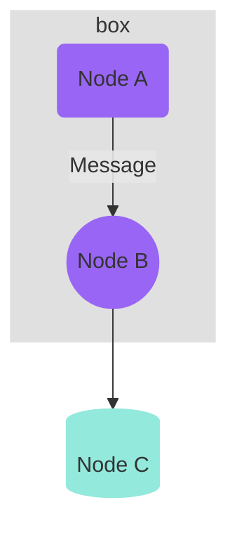

<!-- Snippets for using the mermaid graphs -->

```mermaid
graph TD;
  subgraph box
    x(Node A) -- Message  --> y((Node B));
  end
  y --> z[(Node C)];
  classDef default fill:#9965f4,stroke:#9965f4;
  classDef sub fill:#E0E0E0,stroke:#E0E0E0;
  classDef other stroke:#92e9dc,fill:#92e9dc;
  class z other;
  class box sub;
```
